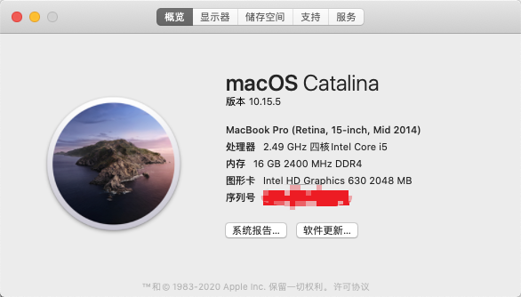
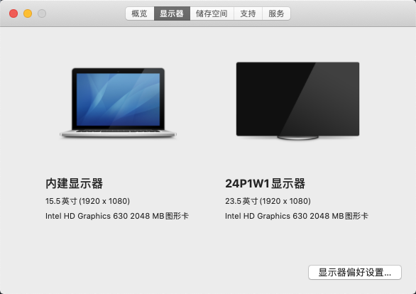

# 联想拯救者R720 15IKBN 黑苹果 EFI

** 不再建议使用此 EFI，推荐使用 [支持 Monterey 版本](https://github.com/happylzyy/Hackintosh-Lenovo-R720)。使用前请查看对应 Issues 中的记录，可能会对你有所帮助。**

## 电脑配置信息

| 硬件项目 | 型号数据 |
| - | -|
| 电脑型号| 联想拯救者 R720-15IKBN|
| CPU | Intel Core i5-7300HQ|
| 显卡 | 核显 HD 630; 独显 GTX 1050 Ti    |
| 有线网卡| Realtek RTL8168GU/8111GU|
| 无线网卡/蓝牙（已更换） | BCM94352Z(DW1560)|
| 声卡| Realtek ALC235 |

## 可用情况

- 核显正常驱动（2048MB）
- CPU正常使用
- 扬声器麦克风正常
- 有线网卡可以正常使用
- 触控板基础手势没问题
- 摄像头正常
- SUB接口、键盘等正常
- 蓝牙、隔空投送、iMessage、FaceTime等正常（需更换无线网卡）
- HDMI正常

## 如何使用

0. 下载本项目
1. 制作启动盘，镜像网上找吧。启动盘制作可以参考 [这个视频](https://www.bilibili.com/video/BV1yq4y1o7cT?p=4)。只需要把本项目的`EFI`目录中的`BOOT`和`CLOVER`替换到启动盘中即可。
2. 对系统BIOS进行一定设置，拯救者这款电脑BIOS中的可设置项较少，不清楚可以问我。
3. 接着按流程进行安装。
4. 安装完成后，用Clover配置器挂载分区将启动盘中的EFI拷贝到电脑中，这一步骤上面的视频链接中也有演示。
5. 替换后注入三码，可以参考 [这篇文章](https://imacosx.com/scb/5078.html) 直接按照方法二使用`Hackintool`工具生成后对应的填入到`Clover Configurator`中即可 **注意检查下序列号是否可用**。接着重启就可以了。

**注意：需要自行操作的也就只有注入三码，其它全部不用修改。**

## 其它

- 机型设置为`MacBookPro11,2`。
- 此EFI应该是完全可用的，如果你喜欢折腾也可以尝试一下其它的。

## 截图

